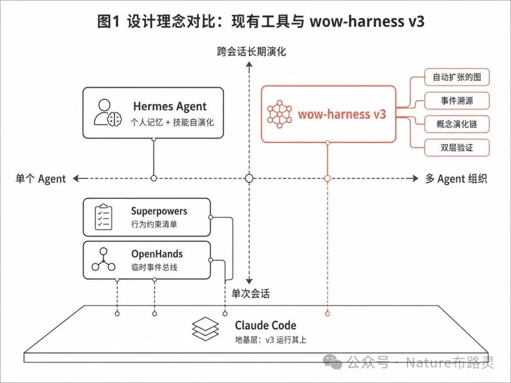
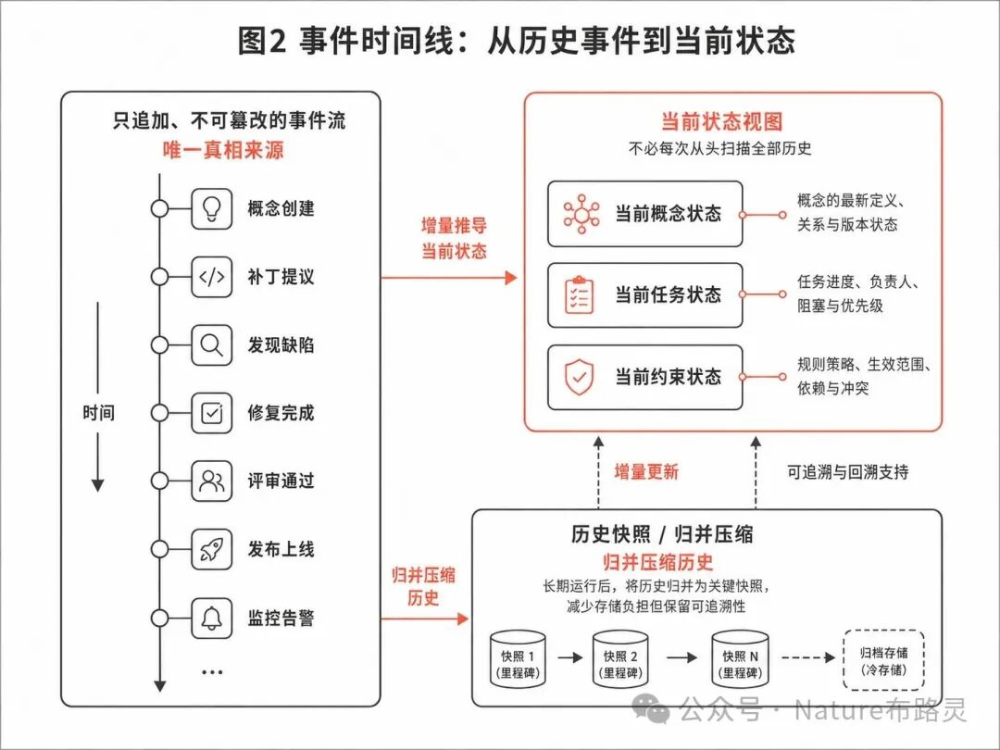
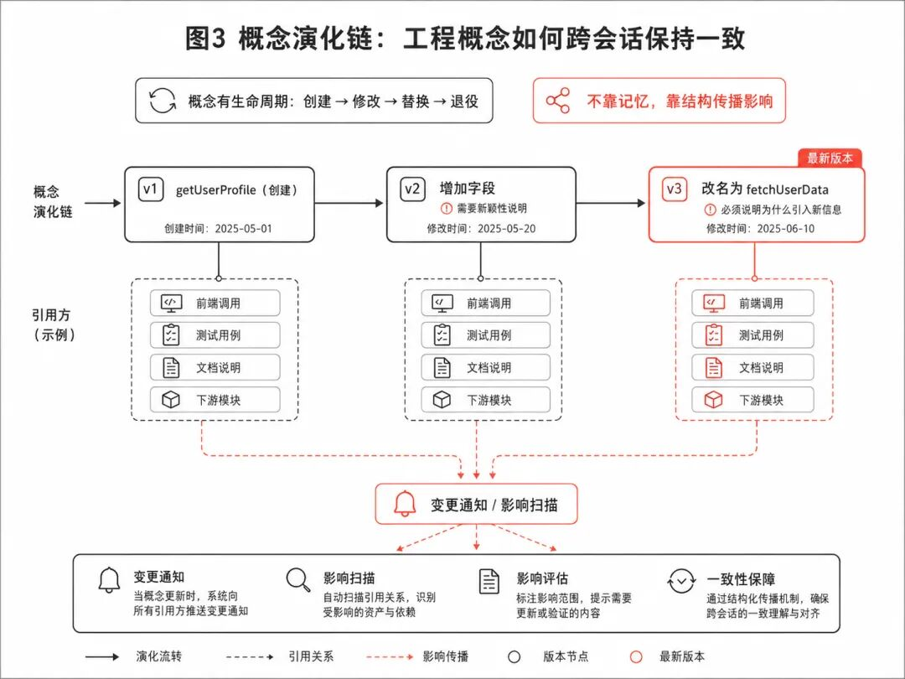
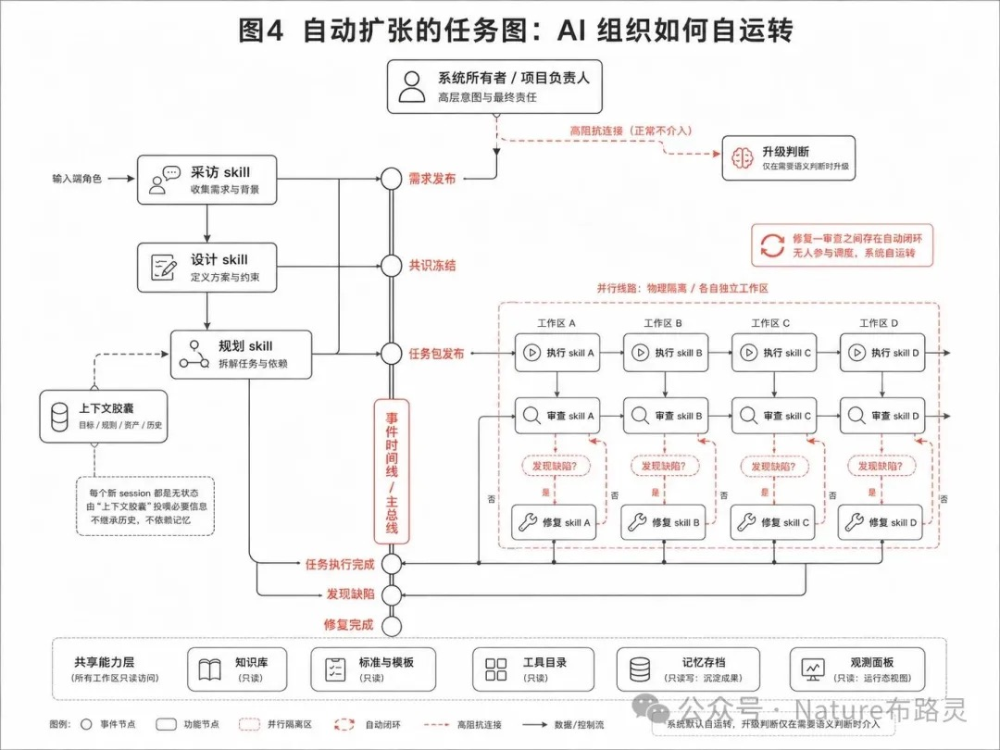

# Hermes Agent 之后：AI 开发需要一层治理协议

> wow-harness v3 技术分享  
> **作者**: 张晨曦（Nature）  
> **来源**: [微信公众号](https://mp.weixin.qq.com/s/kXNivwgCweGoV-xW_WoCtg)  
> **发布时间**: 2026-05-20

---

## 核心判断

**AI 写得越多，我维护它越累。**

不是 AI 不够聪明，是它每次都在重新发明你之前已经建立过的约定。

> **协议比能力重要，治理比智能重要，长期连贯性比单次质量重要。**

---

## 一、为什么现有工具都没碰这件事

四个工具（Claude Code、Superpowers、Hermes Agent、OpenHands）有一个共同特征：**都在优化"一个人 + 一个 agent"的体验**。

但真实项目不是跑一次，它跑几十次、几百次。不同的 session、不同的 agent、不同的阶段——它们之间怎么保持一致？

你跟 AI 工作了两周建立了一些约定（API 字段、错误码、模块职责），第三周换 session，AI 不知道这些约定，根据模型常识猜了一个不同版本。八周后，系统里有好几套互相矛盾的设计思路。

过去靠人管，但 AI 产出代码的速度已经超过人脑能跟上的速度。

Anthropic 在 Claude Code 部署博客里写了一句关键的话：

> **"真正决定效果的，是围绕模型搭起来的那套'套具'（harness），对最终效果的影响远超模型本身。"**

目前的套具都在管"一次做好"。管"一百次之间不漂移"的套具，还没有人做。

### 工具定位对比（四象限）



| | 单次会话 | 跨会话长期演化 |
|---|---|---|
| **单个 Agent** | — | Hermes Agent（个人记忆 + 技能自演化） |
| **多 Agent 组织** | Superpowers（行为约束清单）、OpenHands（临时事件总线） | **wow-harness v3** |
| **地基** | Claude Code（v3 运行其上） | — |

---

## 二、wow-harness v3 的五个核心问题

### 问题 1：AI 做过的事，怎么不丢？

**场景**：三个月前的架构决策在对话窗口里，session 关了就没了。三个月后另一个 agent 做了不同的决策。

**v3 做法**：
- 所有 agent 产出（代码改动、判断、概念调整）作为**事件写入只追加、不可篡改的时间线**
- 时间线是整个系统的**唯一真相来源**
- 配套机制：
  - **增量推导当前状态**（不需要每次从头扫描）
  - **定期归并压缩成关键快照**（保留可追溯性但减少存储）



**左**：只追加事件流（概念创建 → 补丁提议 → 发现缺陷 → 修复完成 → 评审通过 → 发布上线 → 监控告警）

**右上**：当前状态视图（概念状态、任务状态、约束状态）

**右下**：历史快照归并压缩（快照1 → 快照2 → 快照N → 归档存储）

---

### 问题 2：工程概念跨 session 怎么不漂移？

**场景**：第一周约定 API 叫 `getUserProfile`，第三周另一个 agent 改名为 `fetchUserData`，第五周又一个 agent 按老名字写了调用。

**v3 做法**：
- 每个工程概念是独立节点，有自己的生命周期：**创建 → 修改 → 被替换 → 退役**
- 概念被替换时，系统自动扫描"谁还在用旧版本"并通知
- **关键约束**：替换必须说明"引入了什么之前没有的新信息"。如果只是"我觉得新名字更好"，系统不允许替换——这消除了长期项目的振荡问题



**演化链示例**：
- v1 `getUserProfile`（创建，2025-05-01）
- v2 `增加字段`（修改，需新颖性说明，2025-05-20）
- v3 `改名为 fetchUserData`（替换，需说明新信息，2025-06-10）

每个版本都关联引用方（前端调用、测试用例、文档说明、下游模块），变更自动触发影响扫描和一致性保障。

---

### 问题 3：怎么确保 AI 的产出真的做完了？

**场景**：AI 说"修完了"，但改了主文件没同步测试文件；改了 API 返回值没更新文档；或者 bug 换了个位置又出来了。

**v3 做法**：双层验证

**第一层：自检**
- agent 提交前必须跑一组自检项
- 每项要有具体验证证据（命令输出、测试报告、grep 结果）
- 通过**物理层面**的统一提交检查点拦截不合格产出
- 与 Superpowers 的"提示词约束"有本质区别：自检不过就提交不了

**第二层：交叉验证**
- 另一个独立 agent 做交叉验证
- 验证 agent **没有写权限**（schema 级限制）
- 做判断的人不能同时是做事的人

---

### 问题 4：怎么让 AI 不是"一个工具"而是"一个自己运转的组织"？

这是 v3 跟所有现有工具最根本的差异。

**Superpowers 假设**：agent 是需要被管教的执行者——你告诉它"先写测试再写代码"，它照做。每次都是人给指令、agent 执行、session 结束。

**v3 假设**：**agent 不是执行者，是组织成员**。多个 agent 组成自己运转的开发组织——采访员、架构师、执行者、审查员、修复师——协作不靠人调度，靠协议自动驱动。

**核心结构：自动扩张的图**
- 每个节点是一个 agent skill（采访、设计、规划、执行、审查、修复）
- 边是事件触发关系
- 一个节点完成产出事件，系统自动检查"该触发哪个下游节点"，然后自动 spawn 新 agent session

**示例闭环**：
```
执行 agent 写完代码
  → "任务完成"事件
    → 自动 spawn 审查 agent
      → "发现缺陷"事件
        → 自动 spawn 修复 agent
          → "修复完成"事件
            → 自动 spawn 审查 agent 做闭合验证
```

整条链路**没有任何人参与调度**——图自己在扩张、收缩、运转。

**关键设计**：每个新 spawn 的 agent session 都是**无状态**的，不继承上一个 session 的偏见和惯性。它拿到系统专门组装的**上下文胶囊**（包含需要知道的概念、约束、引用关系），从 artifact 出发做独立判断——像新员工入职，看交接文档就能开始工作。

这意味着：**项目负责人说完需求就可以退场**。后面的一切（设计、规划、执行、审查、修复、集成）是 AI 组织自己完成的。

与 Superpowers "brainstorm → plan → TDD → review → finish" 的线性流程有根本区别：
- 直线做不了并行（5 个 agent 同时做 5 个任务）
- 直线做不了回路（审查发现问题 → 自动触发修复 → 修复完自动触发闭合验证）
- 直线做不了跨任务的概念冲突检测

**图可以**。



**上图详解**：
- **左侧流程**：采访 skill → 设计 skill → 规划 skill → 任务包发布
- **并行工作区**（A/B/C/D）：执行 skill → 审查 skill →（发现缺陷？）→ 修复 skill → 回到审查
- **自动闭环**：修复-审查之间无人参与调度，系统自运转
- **高阻抗连接**：系统所有者仅在需要语义判断时升级介入
- **底部共享能力层**：知识库、标准与模板、工具目录、记忆存档、观测面板（所有工作区只读访问）

---

### 问题 5：项目负责人怎么不退化判断权？

**场景**：AI 越来越自动化，项目负责人要么被拉进大量工程细节，要么完全退出判断循环（事后才发现方向偏了）。

**v3 做法**：严格区分两类决策

| 类型 | 决策内容 | 处理方式 |
|---|---|---|
| 工程实施类 | 怎么写、怎么测、怎么部署 | AI 自己做，不问人 |
| 语义判断类 | 产品方向、不可逆操作、价值取向 | 走"升级"路径送到系统所有者面前 |

升级时用**产品语言**描述情况、列出选项和各自代价，让系统所有者直接判断"要 A 还是 B"。

系统所有者的每次判断本身也是一个事件，写入时间线、永久留痕。

---

## 三、学术验证

2026 年 2 月，arxiv 上出现一篇叫 **ESAA**（Event Sourcing for Autonomous Agents，面向自主 Agent 的事件溯源）的论文，核心命题与 v3 高度重合：

- **意图与执行分离**：agent 只发出结构化意图声明，由独立验证器检查后才写入不可篡改的事件日志 → 对应 v3 "事件意图 → 提交检查点验证 → 事件记录"
- **长期一致性**：AI 开发从"对话式"转向需要长期连贯的工作流 → 对应 v3 概念图 + 演化链 + 新颖性检查
- **状态漂移**：agent 相信自己修复了问题但系统实际没变 → 对应 v3 双层验证 + 物理拦截

ESAA 目前是论文阶段。v3 在多个维度超出论文范围：概念节点生命周期状态机、约束规则独立生命周期、上下文胶囊机制、三正交审查方法论、闭合合约驱动修复协议。

---

## 四、跟现有工具的根本区别

**Claude Code 是 v3 的地基，不是竞争对象。** v3 跑在 Claude Code 上面——用它的终端环境、子 agent 机制、工具系统。Claude Code 管"单次 session 怎么高效执行"，v3 管"跨 session 的组织级治理"。

**真正在同一层竞争的是 Superpowers、Hermes Agent、OpenHands**：

| 工具 | 设计假设 | v3 的差异 |
|---|---|---|
| **Superpowers** | agent 是需要管教的执行者，14 个 skill 文件是行为约束清单 | v3 的 agent 拿到的是完整系统理解（角色、上下游、概念状态、约束），行为从理解自然推导，不是被清单约束 |
| **Hermes Agent** | 一个人的助手，围绕"一个用户 + 一个 agent" | v3 从第一天就假设多 agent 并行，是一群 agent 变成一个组织 |
| **OpenHands** | EventStream 是 session 内部消息总线，session 结束就消失 | v3 事件时间线是永久的，是历史记录和真相来源 |

---

## 关于作者

**张晨曦（Nature）**，通向惊喜科技创始人，大四在读。

之前设计的通爻协议（ToWow Protocol，面向跨组织 Agent 协作的 A2A 协议）已被多个独立研究团队走了同方向并独立验证，现已商业化。

wow-harness 是通爻协议体系中面向单组织内部 AI 协作治理的一层（端点 Runtime 位置）。Harness v3 共 21 个模块，设计文档约 50,000 行，经历六轮版本迭代。

本文覆盖的是 v3 骨架：事件溯源、概念演化、双层验证、自动扩张任务图。同一协议体系还包含：基于证伪主义的三正交审查方法论、闭合合约驱动的缺陷修复协议、约束规则独立生命周期管理、上下文胶囊机制等。
