# 分布式 Harness

Agent 一次次显形、行动、消散；Harness 要解决的是这些短命生命如何协作、留痕、继承，并把智慧推向更大的流动。


<details>
<summary>text_image</summary>

通向智流 智力不是库存、是流动、支流、织流 </details>

破除三种相

# 大家对 Agent 最大的误解是什么？

人们把 Agent 想成一个人、一个工具、一个界面，于是所有后续设计都被这个形牵着走。误解从这里开始。

像人

期待它有常识、记忆和责任感。

像工具

期待它像按钮和脚本一样稳定。

像界面

期待它必须有窗口、角色和语气。

一开始想错，后面都会错

# 三种相，三种设计后果

这些比喻都能帮人靠近 Agent，但如果把它们当成本体，后面的 Harness 设计会一起偏掉。

# 当作人

你会反复追求 “说清楚需求”，但它不是一个有稳定常识的人。

# 当作工具

你只期待稳定执行，于是看不见复杂任务里的可塑性。

# 当作界面

你把 Agent 绑在窗口和角色上，于是看不见后台协作。

上下文不是材料包

# 上下文不是上传附件

很多人说“给 AI 上下文”，其实只是在上传资料。真正的上下文，是它这一次能看见的一切。

不只是材料 文件、原话、历史、规则，都只是其中一部分。

也包括工具 它能调用什么，决定它能行动到哪里。

还包括边界 什么能改、什么能提交、什么算事实，都会改变它。

它只能在窗口里行动

# 它不是看见世界，而是看见一个被切出来的窗口

窗口内的东西会被它当成世界；窗口外的东西并不会自动存在。能力首先是视野的产物。

看见什么

决定它能理解什么、能判断什么。

看不见什么

决定它会在哪里误判、停下或偏航。


<details>
<summary>flowchart</summary>

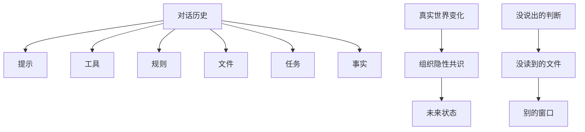
</details>

它不是看见世界；它看见一个被切出来的窗口。

寄生在哪里，就显成什么

# 同一团能力，附着在哪里，就显成什么

像毒液一样，附着在代码库、访谈、审查或玄学语境上，显出来的形完全不同。差异不是身份标签，而是附着点。


<details>
<summary>flowchart</summary>

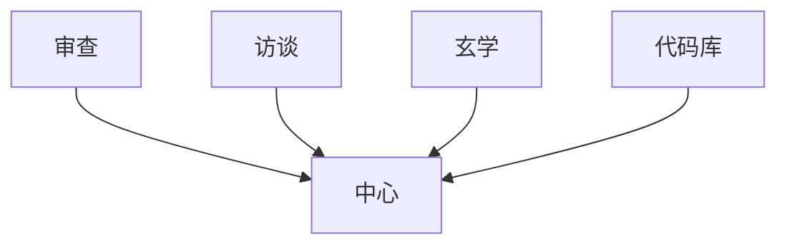
</details>

同一团能力，附着在哪里，就显成什么。

德勒兹的差异，作为一个锚点

# 上下文是生成条件

差异不是两个固定实体之间的比较；差异在关系、条件和生成过程中出现。Agent 的差异，也是在上下文里生成。

# 身份只是标签

写代码、营销、研究、客服，只是入口名。

# 条件生成差异

提示、工具、权限、事实和边界，共同生成它。

# Harness 进入这里

不是增加角色，而是安排生成条件。

一次上下文，一次生命

# 它不是一直在那里，而是一次显形

输入进来，窗口被切出来，行动单元开始工作，输出留下痕迹，然后消散。下一次再由新的上下文重新召唤。

输入

任务、文件、提示、已有事实。

输出

结果、判断、事件、可召回痕迹。


<details>
<summary>flowchart</summary>

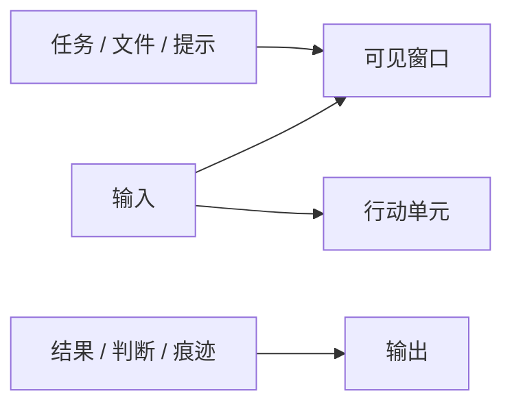
</details>

一次上下文，就是一次生命。

协作问题

# 横向并行，不是共享大脑

多个单元并排工作，每个都有自己的输入、窗口和输出。协作的关键不是“大家一起想”，而是局部结果如何互相可用。

局部

每个单元只处理自己能看到的上下文。

接口

输出物、事件、概念和结果，成为单元之间的接口。


<details>
<summary>flowchart</summary>

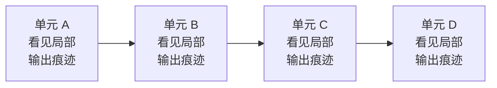
</details>

横向并行，不是共享大脑，是结果互相可用。

记忆问题

# 一个单元的输出，进入下一个单元的输入

单对话看起来连续，其实也是断点式接续。记忆不是它一直活着，而是上一次留下来的东西，被下一次重新读到。

断点

一次显形结束，下一次并不会天然继承一切。

接续

痕迹、摘要、事实如何被重新使用。


<details>
<summary>flowchart</summary>

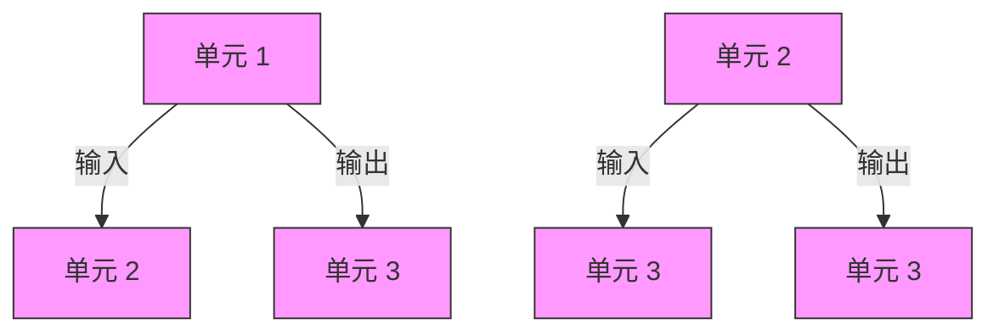
</details>

垂直串行，就是断点之间如何接续。

显形条件

# Harness 管的不是 Agent

它管的是附着点、可见世界、留痕方式和接续机制。分布式不是一开始的定义，而是从这些局部生命的协作问题里长出来的。

# 显形条件

它这次附着在哪个上下文上。

# 公共痕迹

它做完以后什么能被追溯和召回。

# 接续机制

下一次显形如何继承这一次的结果。

维度透镜

# 高维不是更多信息，低维不是更少信息

高维，是低维透镜无法完整看见的感受、判断、意图和世界。

低维，是能传播、能执行、能存储的切片。

高维。

更接近真实感受，但不能被一次穷举。

低维。

更容易行动和保存，但一定有损失。

# 高维 / 低维

不是信息多少，而是能否被低维透镜完整看见。


<details>
<summary>flowchart</summary>

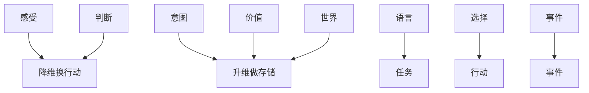
</details>

降维换行动

# 说出来的，已经不是感受到的

但如果不说、不写、不切成任务，它就没有操作性。降维不是

错误，它是行动的入口；损失和歧义，是行动能力的代价。

传法

法一旦说出来，就变成可传递的形。

任务

意图一旦拆出来，就变成可执行的边界。

# 降维换行动

说出来、写出来、拆成任务，都是为了让它能被执行。


<details>
<summary>flowchart</summary>

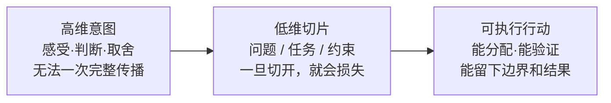
</details>

低维转高维

# 存储不是堆碎片，而是让碎片重新长出语义

低维切片足够多，才能拼出一个高维侧写。系统要保存的不是

一堆散落的片段，而是能被下一次理解和继承的语义承载。

切片

原话、判断、选择、事件、结果。

升维

命名、归纳、归档，再交还给人判断。

# 低维转高维

可存储的切片越多，越能重新拼出更高维的语义侧写。


<details>
<summary>flowchart</summary>

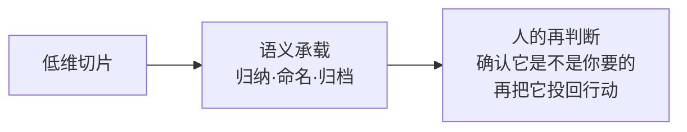
</details>

# 一次生命，如何被下一次继承？

Agent 会结束；继承靠三种证据和两种承载。


<details>
<summary>flowchart</summary>

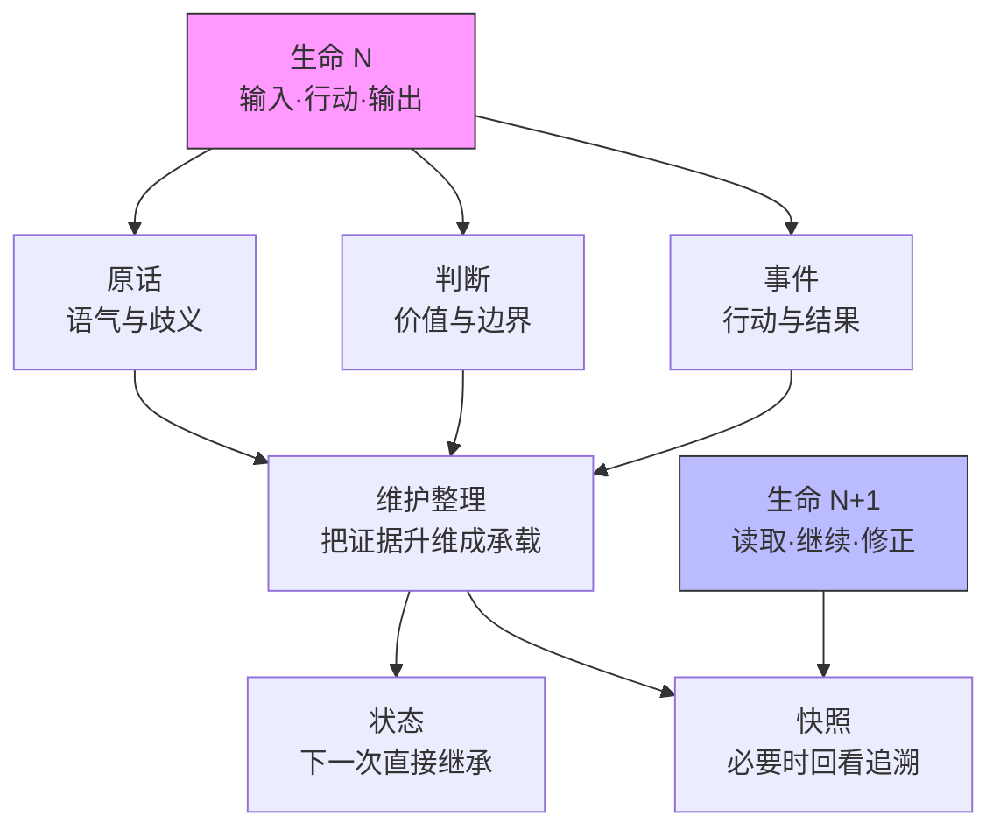
</details>

三种证据保真，两种承载继承。

一次生命结束后，留下原话、判断、事件三种证据。

维护系统把证据整理成状态与快照，供下一次继承和追溯。

同一个循环，发生在四个层级

# 降维、行动、升维，不只发生在 Agent 里面

人理解自己，人和 Agent 协作，一个 Agent 完成一次生命，多个 Agent 之间接续，都在反复做同一件事。

# 四层循环

同一个维度转换，在不同层级反复发生。


<details>
<summary>flowchart</summary>

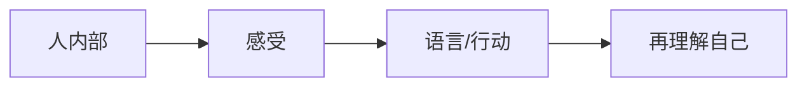
</details>


<details>
<summary>flowchart</summary>

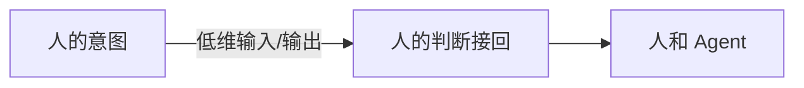
</details>


<details>
<summary>flowchart</summary>

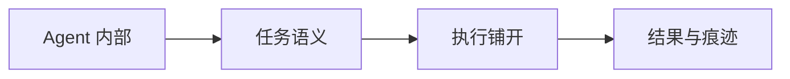
</details>


<details>
<summary>flowchart</summary>

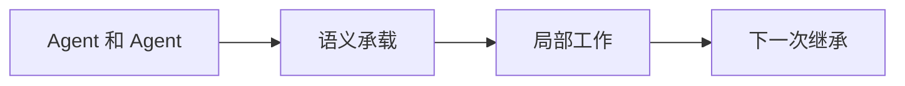
</details>

第一循环 / 第二循环

# 先发生在人身上，再发生在人机之间

# 人内部循环

感受先降成语言和行动，再通过反馈重新理解自己。理清想法本身，就是一次升维。

# 人和 Agent 循环

人的意图降成输入，Agent 给出二维输出，人再用三维判断把它接回现实。

第三循环 / 第四循环

# 再发生在一次生命里，也发生在生命之间

Agent 内部循环。

它拿到语义任务，在低维执行层快速铺开，留下切片、结果和边界。

Agent 和 Agent 循环。

一个单元的结果被维护、整理、退休、归档，再成为下一个单元可继承的语义。

维度看错以后，协作就会错

# 两种幻觉，都会把人从循环里拿掉

一种是高估二维输出，另一种是低估自己没有说出来的高维部分。它们看起来相反，本质上都是把维度关系看平了。

# 两种幻觉

人和 Agent 的错位，常常不是能力问题，而是维度看错了。

# 幻觉一

把二维输出

当成三维真实

结果看似完整，实际缺少世界。

人会被它拖着走。

# 幻觉二

把三维感受

当成二维文本

以为一次说清楚就够。

结果不知道自己没说清楚。

把二维输出当成三维真实

# 它说得像完整世界，但它只看见窗口

如果人把输出当成现实本身，就会被它拖着走：缺少常识、不能落地、方向偏掉，最后才发现需要由人补上的世界一直没有进入上下文。

症状

看起来很顺，但落地时缺一块。

原因

输出完整，不等于世界完整。

修正

把人的判断重新接回循环。

把三维感受当成二维文本

# 你以为自己说清楚了，其实只是说出了一层

人的需求、偏好和判断无法一次穷举。以为一次输入就能完成表达，会让系统永远在信息不透明里猜。

症状

反复觉得“它怎么还是不懂”。

原因

人的真实意图没有被充分萃取。

修正

用追问、选择和判断持续降维。

HUMAN IN THE LOOP

# 人不是审查按钮，人是维度循环的上升端

人的工作不是建更多系统，而是把自己的想法理清楚，把不可穷举的感受一次次转成系统能接住的形，再把系统输出接回现实。

输入

把高维意图降成可行动的上下文。

判断

把低维输出升回人的现实感和取舍。

# 人的位置

Human in the loop 不是审批按钮，而是维度循环里的上升端。


<details>
<summary>flowchart</summary>

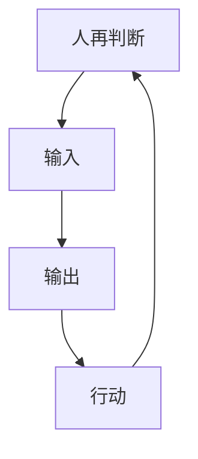
</details>

人负责把不可穷举的东西，一次次重新接回现实。

CONTEXT GENERATION PROTOCOL / INTENT EXTRACTION LAYER

# 采访不是聊天，是上下文生成

追问、现实锚定、场景构造、信息价值判断，是为了把人的高

维意图萃取成可行动、可传递、可维护的上下文。

意图萃取

把模糊感受问成可判断的对象。

上下文生成

把对象组织成下一步能使用的工作包。

# 上下文生成协议 / 意图萃取层

Context Generation Protocol / Intent Extraction Layer


<details>
<summary>flowchart</summary>

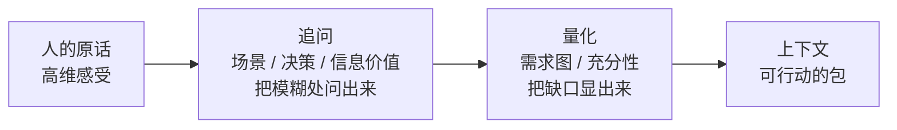
</details>

# 工具组墙

它不是一个问答表单，而是一组把意图变成上下文的工具。

# 现实锚定研究

Grounding Research

# 场景构造

ConOps

# 信息需求图

Info Need Graph

# 决策透镜

Decision Lenses

# 信息价值判断

Vol Gate

# 人类判断捕获

Human Judgment

# 一致性校验

Consistency Check

# 信息充分性

Information Power

# Brief 凝结

Brief Consolidation

# 信息需求图

从未来的行动，反推现在必须知道什么。


<details>
<summary>flowchart</summary>

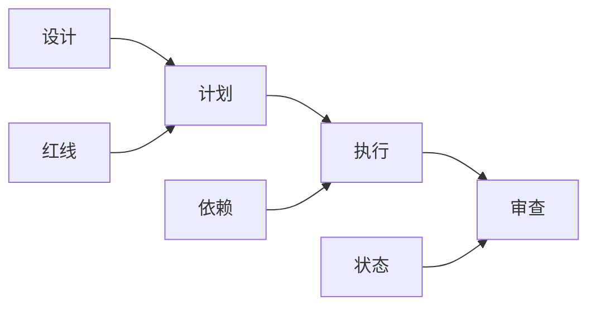
</details>

下游要做什么，决定上游必须问清什么。

InfoNeed 节点承载：来源、缺口、红线、依赖、下游用途、当前状态。

# 决策透镜工具组

不是堆术语，是用不同透镜把同一个模糊意图照亮。

运行场景构造 ConOps

把系统放进真实使用场景

结构化决策反推 SDM

从决策反推选项、指标和约束

关键决策追问 CDM

找到真正影响结果的判断点

决策影响图 Influence Diagram

看见变量之间怎样互相影响

信息价值判断 Vol

判断这条信息值不值得继续问

信息充分性评估 Info Power

判断现在是否足够进入下游

# 信息充分性评估

不是问“资料够不够多”，而是问“下游能不能开始”。

# 硬门槛

红线是否已经清空

方向是否足够稳定

设计是否能够推出

Nature 独特判断是否覆盖

# 质量维度

广度

特异性

可对话性

质量

够了 / 不够 / 有条件地够了

# 实体注册

切片被命名以后，才会变成系统可以维护的对象。


<details>
<summary>flowchart</summary>

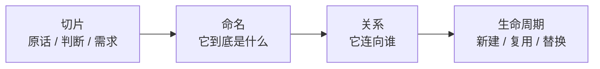
</details>

注册不是填表格，是让模糊东西获得身份、来源、状态和可追溯关系。

# 关系切面

不把全局塞进窗口，只让概念知道自己的邻居。


<details>
<summary>flowchart</summary>

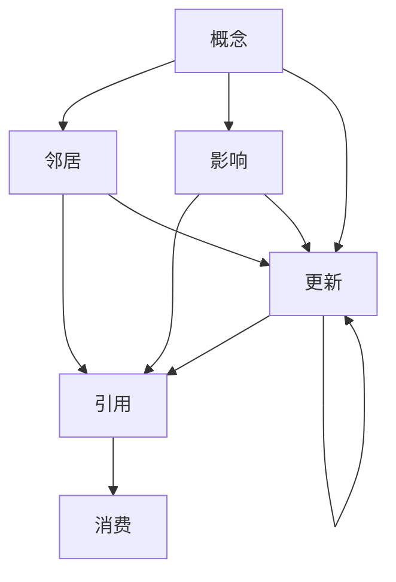
</details>

# Fork 与胶囊

用一个小窗口去摸清一个局部，再把结果带回来。


<details>
<summary>flowchart</summary>

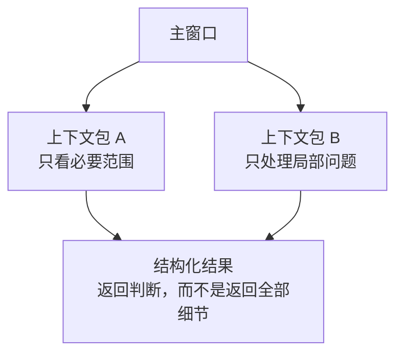
</details>

# 维护与升维存储

后台维护像做梦：扫过低维切片，把它们整理成下一次可继承的语义。


<details>
<summary>flowchart</summary>

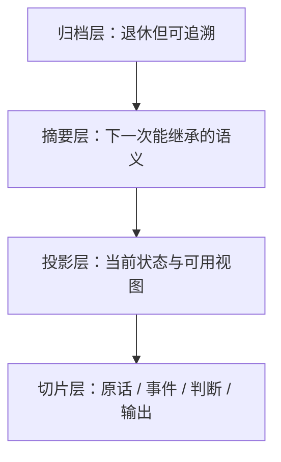
</details>

# 智慧应该流动，而不是停在 一个窗口里

一个会话里有多个队友；每个队友可以派出多个子会话；窗口、终端、机器、组织、框架，都可以成为流动的边。分布式 Harness 打开的，是跨窗口、跨机器、跨框架的想象力。

# 横向切面

一个窗口不是终点，它只是更大分布式网络里的一个节点。


<details>
<summary>flowchart</summary>

```mermaid
graph LR
    A["会话"] --> B["队友"]
    B --> C["子会话"]
    C --> D["窗口"]
    D --> E["机器"]
    E --> F["组织"]
    B --> G["网络连接"]
    C --> G
    D --> G
    E --> G
    F --> G
```
</details>

智流不是一条主河，是很多支流被织起来。
