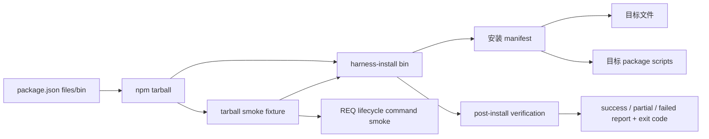

# REQ-2026-089 设计：公开分发与安装闭环

## 1. 设计目标与方案选择

本设计修复 npm 获取、候选包内容、目标项目安装和重复安装四段契约，不改 Hook、REQ CLI 或事件架构。评审过三种方案：一是立即引入完整 capability manifest 和升级系统，长期最统一但会把 P0 修复扩成 P1/P2；二是只修 README 和几个脚本别名，成本低但无法证明 tarball、状态保护和失败语义；三是先在 package、installer、测试和三个公开说明面内闭环，并为后续 manifest 保留清晰迁移面。选择第三种。公开 npx 命令同时存在于 README、Claude command 和 source-command skill；三者必须原子同步，因此本 REQ 记录了 6 个实现文件的颗粒度例外。

`package.json` 成为 npm 发布边界：声明 Node 版本、ESM 类型和逐文件 `files` allowlist。allowlist 只包含安装器实际需要的模板、脚本、skills 和入口文档，不包含内部 INDEX/completed/report dogfooding 历史、tests 或运行时 `.claude/events|session-log|worktrees`。新项目 INDEX 由安装器生成，不再把模板仓库历史装进 tarball。README 只展示经本地 tarball smoke 验证的命令。测试从真实 `npm pack` 产物的符号链接 bin 执行，避免“源码目录可运行”替代“发布包可运行”。

安装器仍保持 skipExisting 的保护性取舍，但把状态文件和配置文件视为用户数据：已有 progress 不覆盖；有效 settings 只增量合并缺失 Hook；无效 JSON 中止而非静默重写。复制与验证失败进入统一结果状态，成功横幅只允许在 `failed === 0` 时出现。

## 2. 组件与数据流

数据流分为两层。发布层由 npm 根据 `files` 生成 tarball，测试读取 tarball 清单并禁止运行时路径、历史数据、本机绝对路径；随后从 tarball 的真实 bin 在临时目标项目执行完整 REQ 周期。安装层先计算所选模块的文件清单，复制不存在的受管文件并生成干净 INDEX，保留用户文件，然后合并目标 `package.json` scripts 与有效 settings。所有阶段都向同一结果对象累计 copied/skipped/failed/verification 信息，最终由结果决定报告状态和进程退出码。

目标 scripts 必须覆盖 README 和 source-command skills 的真实调用。当前两份映射先消除行为差异，但不在本 REQ 新增 schema；P1 将把文件、scripts、profile 和 doctor 期望迁移到单一 capability manifest。

## 3. 错误处理与状态保护

安装失败不能和成功共用同一终态。结果定义为：`success` 表示所有选中资产复制和安装后验证均成功；`partial` 表示部分资产已落盘但至少一项失败；启动前参数/配置无法解析则为 `failed`。`partial/failed` 都返回非零退出码，安装报告保留已完成动作，便于手工恢复。

已有 `.claude/progress.txt` 永远默认 preserve，因为它是当前 active REQ 的事实输入。已有合法 settings 只合并缺失 Hook，不删除用户自定义 matcher 或命令；已有非法 settings 先报错并停止，不生成替代文件。目标 `package.json` 解析失败同样停止，避免写出半合法项目。安装器不在本 REQ 提供隐式 reset；显式升级、备份和冲突合并属于 P1/P2。

测试覆盖：干净安装、已有业务 package、已有 active progress、已有自定义 settings、非法 settings、模拟缺失源文件/验证失败。临时 fixture 全部位于系统临时目录，结束后由测试框架清理；不得触碰仓库已有 session/worktree 运行数据。

## 4. 验证与后续批次

本 REQ 的完成证据不是单一 green test，而是四层证据：单元/fixture 用例证明映射与保留语义；从 tarball 执行 bin 证明发布产物自包含；`npm pack --dry-run --json` 证明文件边界；仓库级 `npm test`、`docs:verify`、`check:governance` 证明无回归。README 中展示的 npx、block 和 doctor 路径必须能映射到真实入口，无法在本 REQ 修复的 CLI 行为要从文档移除或明确标记，不能继续写成已支持。

全评审计划按独立 REQ 顺序推进：

1. REQ-089：P0 发布与安装闭环（本 REQ）。
2. 后续 P0：canonical path、多写目标、CLI/中文 slug 与可执行文档。
3. P1：capability manifest、policy/profile、doctor、升级 v1、状态/worktree 和代表性 CI。
4. P2：按真实耦合模块化、完整冲突合并、更多 agent 与团队协作能力。
5. Pilot：JavaScript、Python、monorepo 各两个周期，并记录激活、恢复、误拦/漏拦和重复使用指标。

每个后续 REQ 必须以本设计中的边界和前一批真实结果为输入，不允许用“计划存在”替代完成证据。
