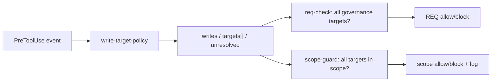

# REQ-2026-090 设计：canonical path 与多写目标门禁

## 1. 方案选择与架构边界

当前两个 Hook 内联了近似但独立的 Bash classifier：req-check 用第一个目标决定是否绕过 REQ，scope-guard 也只检查一个目标。可选方案有三种：继续同步两份正则，改动最小但漂移风险不变；只抽 canonical path，能修 traversal 却仍漏多目标；抽出共享 write-target policy，让两个 Hook消费同一结构化判定。选择第三种。

新增 `scripts/write-target-policy.mjs`，只负责两件事：从 Hook event 提取“是否写、支持模式、原始目标列表、是否存在 unresolved”；把每个原始目标转换为 canonical 结果（绝对路径、repo-relative 路径、是否位于 repo、失败原因）。它不读取 REQ、不决定 allow/block，也不输出用户文案。req-check 负责“是否需要有效 REQ”和治理目录白名单；scope-guard 负责“有效 REQ 的所有目标是否符合 scope”。这种依赖方向避免共享模块知道生命周期或模式策略。

共享模块加入 package `files`、installer CLI/Hook manifest 和硬编码发布契约。这样源码可运行、tarball 可运行和目标项目 Hook 可加载三条链路同时受测试约束。

## 2. 写目标识别与数据模型

策略输出统一为：`{ writes, operations, targets, unresolved }`。`targets` 保留每个目标的 raw 文本、operation 和 role；去重不丢失首个来源。明确支持：所有文件重定向、`tee/sponge` 多文件、`rm/touch/mkdir` 全部 operand、`cp` destination、`mv` source 删除与 destination、`ln` link destination、`sed/perl -i` 的文件 operand，以及用 `;`、`&&`、`||`、pipe 组合的多段命令。纯读命令返回 `writes=false`。

解析采用小型 shell tokenizer，识别单/双引号、反斜杠、常见控制符与 `--`，但不求值变量、glob、command substitution 或解释器代码。识别到写操作却无法稳定确定目标时，必须返回 `writes=true, unresolved=true`，不能降级为 pure read。对 glob/变量目标保留 raw 并标记 unresolved，因为 Hook 不应假装知道运行时展开结果。

文件操作语义按实际写集合定义：`cp a b` 写 `b`；`mv a b` 同时删除 `a`、写 `b`；`ln -s a b` 写 `b`；`rm/touch/mkdir` 的每个 operand 都是写目标。多源 cp/mv 的 destination 目录仍作为目标；无法推导目录内最终文件名时标记 unresolved，使显式 scope 下需要扩大 scope 或使用审计豁免。

## 3. Canonical path 与决策流

相对路径先统一反斜杠、去掉外层引号，再以事件 `cwd`/Git root 为基准解析 `.` 和 `..`。存在目标使用 `realpath`；不存在目标从最近存在祖先 realpath 后拼回剩余段，从而识别“父目录是 symlink、目标文件尚不存在”的逃逸。结果用 canonical root 计算 relative path，避免 `/repo` 与 `/repo-copy` 前缀碰撞。Windows drive/UNC 绝对路径在对应平台使用原生 path 语义；跨平台 fixture 重点验证 repo 内反斜杠输入。

req-check 的治理白名单改为 all-targets-must-pass：只有写操作、无 unresolved、至少一个目标，且所有 canonical 目标都在 repo 内并匹配 `requirements/**`、`docs/plans/**`、`.claude/**` 时才跳过 REQ。混合 `requirements/x > src/y` 不再被首个目标放行。

scope-guard 对直接文件工具和 Bash 使用同一 targets。无 active REQ 仍交给 req-check；有 active REQ但无 scope 的历史文档继续 allow。有显式 scope/只读边界时，unresolved、repo 外、deny 或任一 unmatched 目标都 block，并在 violation log 中记录全部失败目标。scope-guard 在最前面检查 worktree/global exempt，保证紧急豁免确实覆盖两个 Hook；审计仍由现有豁免创建流程负责。

## 4. 错误处理与验证

共享策略对无效 Hook 输入返回非写或结构化 unresolved，不抛异常锁死用户；文件系统 realpath 异常进入 target error，由消费者按 scope 强度决定。scope violation 文案列出具体失败目标与原因，避免只说“命令不在 scope”。Hook 协议 JSON 无法解析仍保持现有 fail-open，这是平台可用性取舍，不在本 REQ 改变。

测试分三层。第一层直接测试 policy：tokenizer、各命令语义、目标顺序和 canonical result。第二层通过真实 Hook stdin fixture 验证 req-check 白名单与 scope-guard all-target decision，包括 `allowed/../secret`、repo prefix collision、反斜杠、symlink ancestor、混合目标和 unresolved。第三层沿用真实 npm tarball fresh-install，断言共享模块在 published allowlist 和目标项目中存在，安装后的 Hook 可执行。

回归要求包括纯读 Bash、无 scope legacy、直接 Write/Edit、read-only REQ、全局/worktree exempt 和既有安装器测试。最终执行 `npm test`、docs/governance gates 与 pack 清单。README 只声明明确支持的模式和 best-effort 边界，不扩大为通用 shell 或 OS 沙箱承诺。
